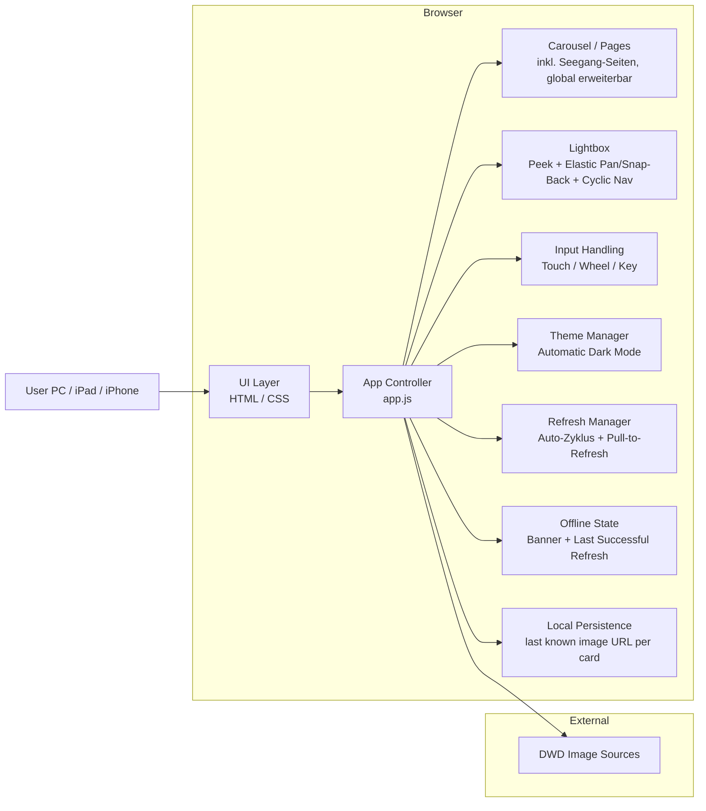

## Gesamtarchitektur

> Update US-013: Seegang-Refresh nutzt einen globalen Datenzyklus (~07/~19 UTC) fuer alle WX_SEE-Seiten.
> Update US-014: Offline-Zugriff bleibt stabil durch lokale Persistenz des letzten erfolgreichen Bildstands je Karte.

