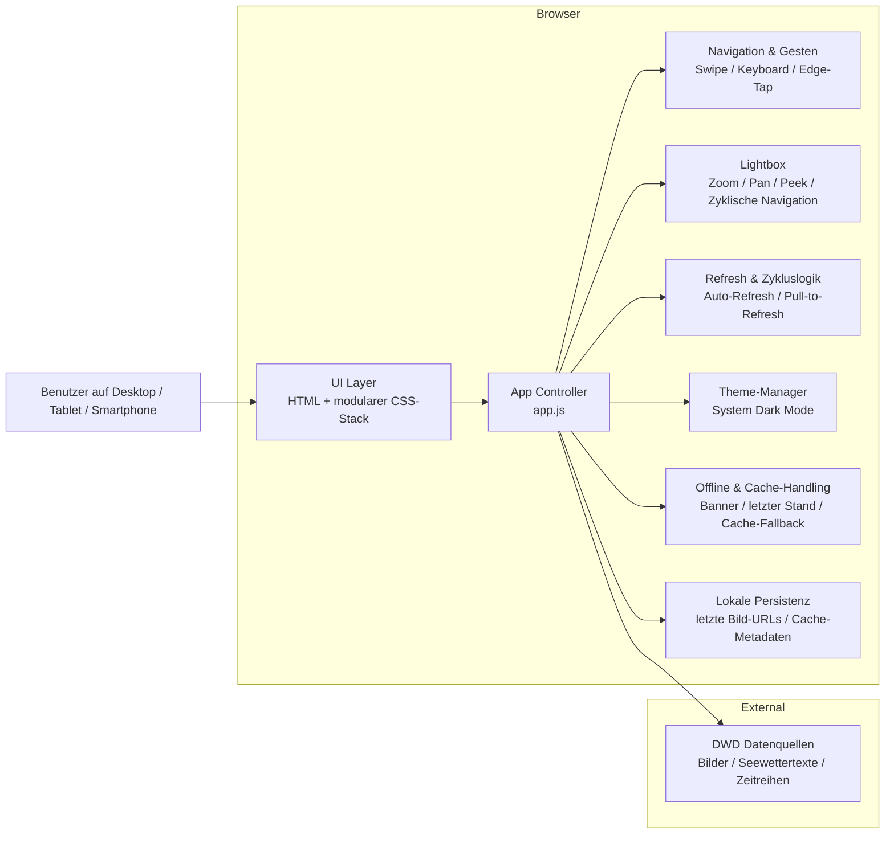

## Gesamtarchitektur

> Teststatus (2026-08-06): Die aktuelle Dokumentation wurde auf die reale Projektstruktur und die umgesetzten Features des Dashboards abgestimmt.

Das DWD Dashboard ist eine leichte, browserbasierte Web-App für Desktop- und Touch-Nutzung. Sie kombiniert Wetterkarten, Seewettertexte, Seegangsvorhersagen und ergänzende Zeitreihen-Ansichten in einem single-pageartigen Carousel-Workflow. Die Architektur ist bewusst minimal-invasiv, ohne Framework, und orientiert sich an einer robusten, offline-fähigen Nutzung im maritimen Einsatzkontext.

### Ziel und Grundprinzipien

- Single-page Aufbau mit einer Carousel- und Lightbox-Interaktion
- Vanilla JavaScript statt Frameworks
- Touch-first Bedienung mit Keyboard-, Swipe- und Edge-Tap-Unterstützung
- Robuste Offline-Funktionalität über Service Worker und lokale Persistenz
- Minimaler Wartungsaufwand bei Erweiterungen wie neuen Seiten oder Overlays
- Erhaltung von Accessibility-Attributen und bestehender Bild-/Badge-Logik

### Architekturübersicht

### Verantwortlichkeiten der Hauptkomponenten

#### 1. UI Layer

Die Struktur der Anwendung lebt in [index.html](../index.html). Sie definiert die Seitenstruktur, die Kartencontainer, den Carousel-Viewport, die Lightbox-Elemente sowie die für die UI relevanten semantischen Bereiche.

Wichtige Rollen:
- Bereitstellung der Seiten- und Kartenstruktur
- Trennung von sichtbarer UI-Logik und semantischer Seitenstruktur
- Bereitstellung der Ankerpunkte für JS-Interaktionen

#### 2. App Controller

Die eigentliche Anwendungslogik liegt in [js/app.js](../js/app.js). Sie steuert:
- Seitennavigation und Gestensteuerung
- Lightbox-Interaktionen wie Zoom, Pan, Peek und Bildwechsel
- Refresh- und Zykluslogik für Karteninhalte
- Theme-Logik basierend auf dem System-Theme
- Offline- und Statuszustände pro Karte
- Zeitreihen-Overlays und spezielle Feature-Integrationen wie AdG-/Gezeitenindikatoren

Die App ist bewusst als zentrale Zustands- und Interaktionsschicht aufgebaut, damit neue Features ohne Framework-Einbindung ergänzt werden können.

#### 3. Styling-Schicht

Die Darstellung ist über die CSS-Dateien in [css/](../css) organisiert:
- [css/tokens.css](../css/tokens.css) für Design-Tokens
- [css/base.css](../css/base.css) für Basis- und Reset-Regeln
- [css/layout.css](../css/layout.css) für Layout- und Grid-Struktur
- [css/components.css](../css/components.css) für UI-Komponenten wie Cards, Lightbox und Zeitreihen-Elemente
- [css/utilities.css](../css/utilities.css) für Hilfsklassen

Diese Aufteilung ermöglicht eine saubere Trennung von Designsystem, Layout und Komponenten.

#### 4. Service Worker und Caching

Die Offline-Funktionalität wird über [js/sw.js](../js/sw.js) gesteuert. Der Service Worker:
- precacht die App-Shell für eine robuste Start- und Reload-Erfahrung
- cached Bild- und statische Ressourcen
- stellt gecachte Inhalte bei fehlender Netzwerkverbindung bereit
- behandelt Seewettertexte und andere externe Inhalte selektiv

Das Ziel ist eine zuverlässige Nutzung auch in schwankenden Netzwerkbedingungen.

#### 5. Datenquellen und externe Abhängigkeiten

Die Anwendung bezieht Inhalte aus DWD-Produktquellen, insbesondere:
- Wetterkarten und Seegangsbilder
- Seewettertexte und Vorhersageinhalte
- Zeitreihen- und Prognoseinformationen

Die fachliche Darstellung bleibt dabei bewusst an die verfügbaren DWD-Produkte gekoppelt; die App transformiert diese Inhalte nur für die Anzeige, ohne eigene fachliche Interpretation zu erzeugen.

### Datenfluss im Überblick

#### Start und Initialisierung
1. Die Seite wird geladen und die HTML-Struktur wird aufgebaut.
2. Die App initialisiert Navigation, Gesten, Theme-Handling und Refresh-Mechanik.
3. Bereits vorhandene Daten werden geladen oder auf gecachte Inhalte zurückgegriffen.

#### Karten- und Seitenwechsel
1. Der Benutzer navigiert durch den Carousel über Swipe, Keyboard oder Edge-Tap.
2. Die App aktualisiert den aktiven Seitenindex und lädt die relevanten Inhalte neu oder nutzt gecachte Zustände.
3. Die Lightbox bleibt unabhängig von der Seitennavigation funktionsfähig.

#### Offline-Fall
1. Wenn das Netzwerk fehlt, greift die App auf gecachte Inhalte zurück.
2. Der letzte erfolgreiche Bildstand bleibt pro Karte erhalten.
3. Ein sichtbarer Offline-Status bleibt erhalten, ohne dass die Navigation verloren geht.

#### Lightbox-Interaktion
1. Eine Karte kann vergrößert werden.
2. Zoom-, Pan- und Swipe-Gesten bleiben im Fokus der Lightbox-Interaktion.
3. Die Lightbox nutzt eigene Navigationslogik, die von der normalen Seitennavigation getrennt ist.

### Qualitätsprinzipien

- Minimal-invasive Erweiterbarkeit statt großer Refaktories
- Hohe Robustheit bei Touch- und Mobilnutzung
- Keine neue Framework-Abhängigkeit
- Schutz der bestehenden Lightbox- und Badge-Logik
- Konservative, nachvollziehbare Daten- und Cache-Strategie

### Erweiterbarkeit

Die aktuelle Architektur ist bewusst so aufgebaut, dass neue Funktionalitäten sich leicht ergänzen lassen, zum Beispiel:
- zusätzliche Karten- oder Seitenkonzepte
- weitere Overlays und Zeitreihen-Ansichten
- zusätzliche Datenquellen oder Kontextinformationen
- weitere Zustandsindikatoren oder fachliche Bewertungsschichten

### Fazit

Die Architektur ist als schlanke, browserbasierte Frontend-Architektur mit klarer Trennung zwischen Struktur, Logik, Styling und Offline-Strategie aufgebaut. Sie erfüllt den aktuellen Anwendungsfall zuverlässig und bleibt flexibel genug für weitere DWD- oder Wetterkarten-Funktionen.
