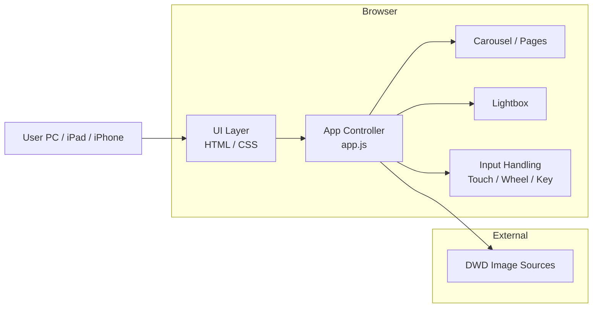

## Gesamtarchitektur

```mermaid
flowchart LR
  User[User PC / iPad / iPhone]
  subgraph Browser
    UI[UI Layer<br/>HTML / CSS]
    App[App Controller<br/>app.js]
    Carousel[Carousel / Pages]
    Lightbox[Lightbox]
    Gestures[Input Handling<br/>Touch / Wheel / Key]
  end
  subgraph External
    DWD[DWD Image Sources]
  end
  User --> UI
  UI --> App
  App --> Carousel
  App --> Lightbox
  App --> Gestures
  App --> DWD
```
