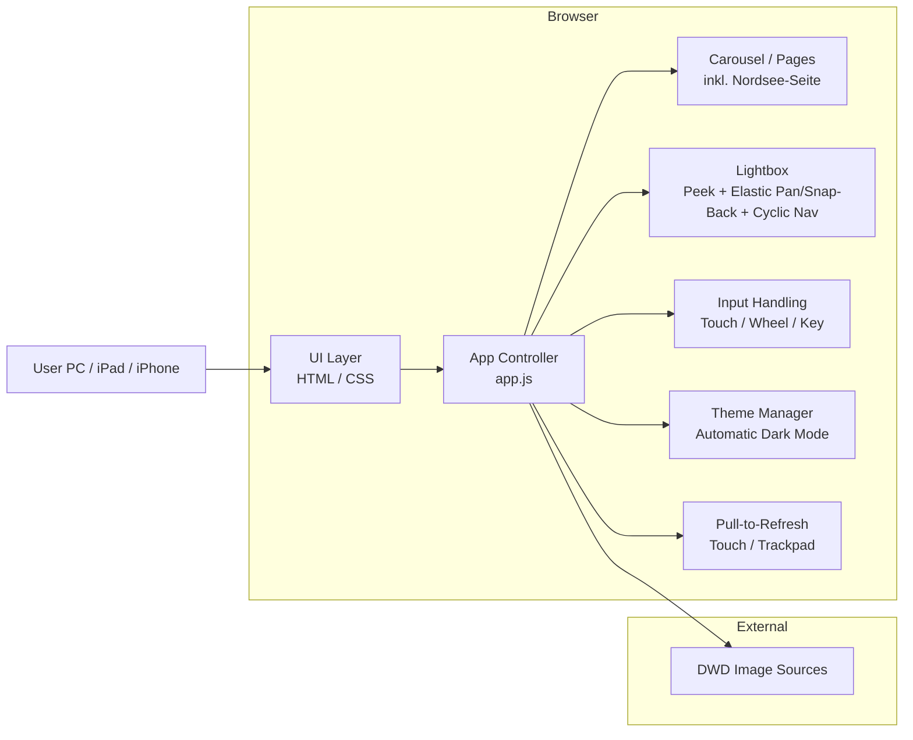

## Gesamtarchitektur

```mermaid
flowchart LR
  User[User PC / iPad / iPhone]
  subgraph Browser
    UI[UI Layer<br/>HTML / CSS]
    App[App Controller<br/>app.js]
    Carousel[Carousel / Pages<br/>inkl. Nordsee-Seite]
    Lightbox[Lightbox<br/>Peek + Elastic Pan/Snap-Back + Cyclic Nav]
    Gestures[Input Handling<br/>Touch / Wheel / Key]
    Theme[Theme Manager<br/>Automatic Dark Mode]
    Refresh[Pull-to-Refresh<br/>Touch / Trackpad]
  end
  subgraph External
    DWD[DWD Image Sources]
  end
  User --> UI
  UI --> App
  App --> Carousel
  App --> Lightbox
  App --> Gestures
  App --> Theme
  App --> Refresh
  App --> DWD
```
