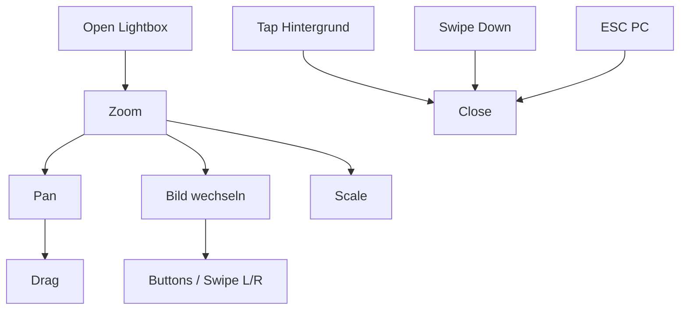

## Lightbox-Interaktionen

```mermaid
flowchart TD
  Open[Open Lightbox] --> Zoom
  Zoom --> Pan
  Zoom --> SwitchImage[Bild wechseln]
  Zoom --> Scale
  SwitchImage --> NextPrev[Buttons / Swipe L/R]
  Pan --> Move[Drag]
  TapBg[Tap Hintergrund] --> Close
  SwipeDown[Swipe Down] --> Close
  Esc[ESC PC] --> Close
```
