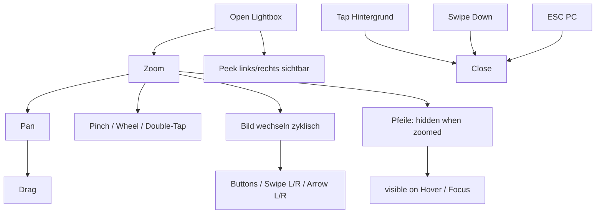

## Lightbox-Interaktionen

> Seit US-009 wurde die Lightbox erweitert: Peek-Nachbarbilder, weichere Bildwechsel und zyklische Navigation.
> Im Zoom-Modus sind Pfeile standardmäßig ausgeblendet und erscheinen bei Hover/Fokus wieder.

