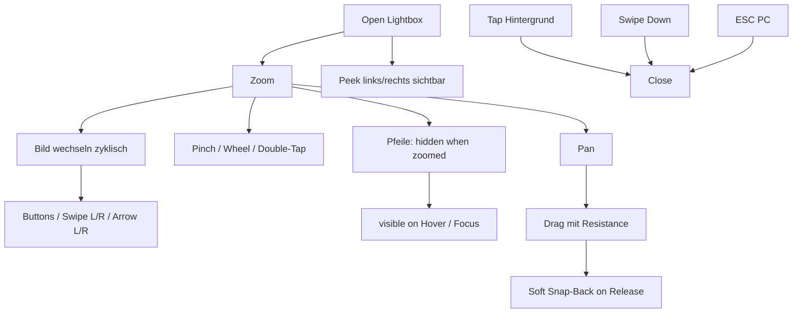

## Lightbox-Interaktionen

> Teststatus (2026-06-20): Erfolgreich abgeschlossen (US-015/US-016, End-to-End geprueft).

> Seit US-009 wurde die Lightbox erweitert: Peek-Nachbarbilder, weichere Bildwechsel und zyklische Navigation.
> Im Zoom-Modus sind Pfeile standardmäßig ausgeblendet und erscheinen bei Hover/Fokus wieder.
> Seit US-010 nutzt Pan ein Elastic-Resistance-Verhalten mit kurzem, weichem Snap-Back in den gültigen Bereich.

