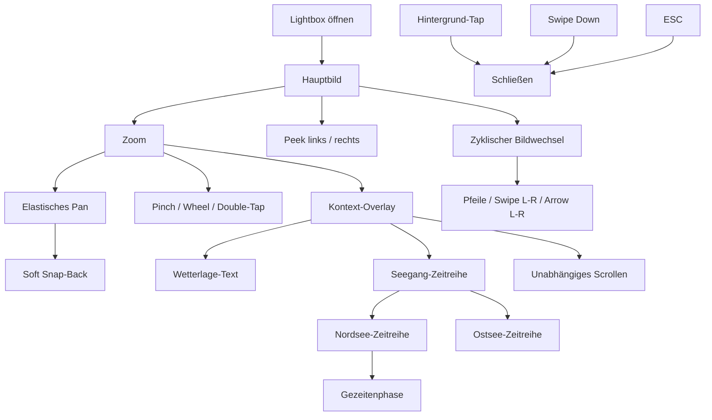

# Lightbox-Interaktionen

> Release-1.6 (2026-08-20): Die Dokumentation beschreibt die aktuelle Bild-,
> Overlay- und Zeitreihen-Interaktion. Die Wind-gegen-Strom-Erkennung (US-006)
> ist nicht Bestandteil der Lightbox und bleibt eine geplante Idee.

## Grundverhalten

Die Lightbox öffnet ein ausgewähltes Kartenbild über dem Dashboard. Die normale
Seitennavigation und die Lightbox-Navigation bleiben getrennte Interaktionen.

- Öffnen per Klick oder Tap auf eine Karte
- Schließen per Hintergrund-Tap, Swipe nach unten oder `ESC` auf Desktop
- zyklischer Wechsel zwischen benachbarten Bildern
- Navigation per Pfeilen, horizontalem Swipe und Tastatur
- Peek-Nachbarbilder links und rechts zur Orientierung
- Pfeile im Zoom-Modus zunächst verborgen und bei Hover/Fokus sichtbar

## Zoom und Pan

- Zoom per Pinch, Mausrad oder Double-Tap
- Seitenverhältnis des Bildes bleibt erhalten
- Pan ist in alle Richtungen möglich
- Bewegungen außerhalb des gültigen Bereichs werden elastisch gedämpft
- beim Loslassen erfolgt ein kurzer, weicher Snap-Back
- Zoom, Pan und Lightbox-Navigation dürfen sich nicht gegenseitig blockieren

## Kontext-Overlays

Das gemeinsame Overlay im Lightbox-Fenster wird abhängig von der geöffneten
Karte befüllt. Es ist scrollbar, halbtransparent und darf die Bildinteraktion
nicht unnötig beeinträchtigen.

### Bodenwetterkarte

- Wetterlage wird nur bei der relevanten Bodenwetterkarte im Zoom-Modus angezeigt
- der gecachte oder online geladene Seewettertext bleibt offline verfügbar
- `Stand:` und ein möglicher Veraltet-Hinweis werden sichtbar dargestellt
- Textstruktur, Seegebiete, Wochentage und Windwarnungen bleiben lesbar

### Seegang Nordsee

- kompakte Nordsee-Zeitreihe im Lightbox-Overlay
- Zeitachse horizontal, Seegebiete in eigenen Zeilen
- Wind, Böen, Wellenhöhe und Wetterereignisse kompakt darstellen
- Gezeitenphase mit Spring-, Mitt- und Nipp-Markern synchron zu den Zeitspalten
- auf schmalen Displays Kurzbezeichner `Sp`, `Mt` und `Np` verwenden

### Seegang Ostsee

- kompakte Ostsee-Zeitreihe im Lightbox-Overlay
- Zeitachse horizontal, Seegebiete in eigenen Zeilen
- Wind, Böen, Wellenhöhe und Wetterereignisse kompakt darstellen
- Zeitreihe initial eingeklappt und bei Bedarf aufklappbar
- keine Gezeitenphase aus der Nordsee-Zeitreihe übernehmen

## Scroll- und Gestenregeln

- Text- und Zeitreihenbereiche bleiben unabhängig scrollbar
- vertikales Scrollen im Overlay darf horizontale Bildnavigation nicht unnötig
  auslösen
- Pinch, Pan, Double-Tap und Swipe zum Bildwechsel bleiben erhalten
- Schließen per Swipe nach unten bleibt außerhalb scrollbar fokussierter Inhalte
  verfügbar
- Änderungen an Overlay-Inhalten dürfen keine zweite Lightbox-Navigation erzeugen

## Änderungsregeln

Bei Anpassungen an der Lightbox:

- vorhandene Zoom-, Pan-, Peek-, Swipe- und Schließlogik wiederverwenden
- Overlay nur für fachlich passende Karten rendern
- Bildquellen, Cache-Strategie und Service Worker nicht ohne zwingenden Grund
  ändern
- Accessibility-Attribute und Tastaturbedienung erhalten
- nach Änderungen fokussierte Tests und anschließend `bash scripts/run-tests.sh`
  ausführen
- `git diff --check` ausführen und die begleitende Doku synchronisieren
