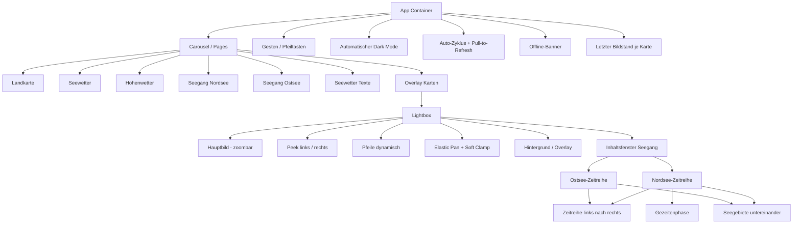

## UI-Struktur

> Teststatus (2026-08-06): Die UI-Struktur wurde auf den aktuellen Stand der Implementierung angepasst.

> Release 1.0: Fokus auf ruhige, bildschirmfüllende Wetterkarten ohne sichtbares Menü, mit natürlicher Navigation und automatischem Dark Mode.
> Update US-009: Die Lightbox zeigt subtile Peek-Nachbarn und nutzt zyklische, weiche Bildnavigation mit elastischem Pan- und Snap-Back-Verhalten.
> Update US-010: Zoom- und Pan-Interaktion sind elastisch und kehren weich in den Ausgangszustand zurück.
> Update US-011: Der Carousel enthält eine zusätzliche Seite für Seegang Nordsee mit zweizeiligem Kartenlayout.
> Update US-012: Der Carousel enthält eine zusätzliche Seite für Seegang Ostsee mit identischem Interaktions- und Layoutprinzip.
> Update US-013: Der Seegang-Refresh folgt einem globalen Datenzyklus für alle WX_SEE-Seiten (~07/~19 UTC).
> Update US-014: Offline-Zugriff nutzt den letzten erfolgreichen Bildstand pro Karte, auch nach Resize- oder Orientation-Änderungen.
> Update US-020/US-021: In der gezoomten Ostsee-Lightbox wird pro Karte ein kompaktes Inhaltsfenster eingeblendet; es zeigt eine kompakte Zeitreihen-Ansicht mit Wind, Böen, Welle und Wetter und lässt sich bei Bedarf zusammenklappen.
> Update US-022: Für die Nordsee-Lightbox wird eine analoge, kompakte Zeitreihen-Ansicht ergänzt.
> Update US-023: Die Nordsee-Zeitreihe enthält zusätzlich eine Gezeitenphase mit farbigen Segmenten und Kurzbezeichnern (Sp/Mt/Np) auf schmalen Displays.

