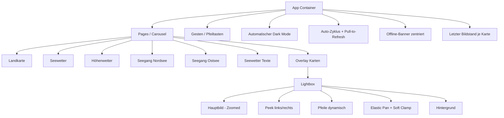

## UI-Struktur

> Teststatus (2026-06-20): Erfolgreich abgeschlossen (US-015/US-016, End-to-End geprueft).

> Release 1.0: Fokus auf ruhige, bildschirmfüllende Wetterkarte ohne Menü, mit natürlicher Navigation und automatischem Dark Mode.
> Update US-009: Lightbox zeigt subtile Peek-Nachbarn und nutzt zyklische, weiche Bildnavigation.
> Update US-010: Zoom-Pan verhält sich elastisch mit weichem Snap-Back beim Loslassen.
> Update US-011: Neue Carousel-Seite für Seegang Nordsee mit zweizeiligem Kartenlayout.
> Update US-012: Zusätzliche Carousel-Seite für Seegang Ostsee im gleichen Interaktions- und Layoutprinzip.
> Update US-013: Einheitlicher Seegang-Datenzyklus für alle WX_SEE-Seiten (~07/~19 UTC).
> Update US-014: Offline-Zugriff mit stabiler Wiederverwendung des letzten Bildstands je Karte, auch nach Resize/Orientation-Change.

