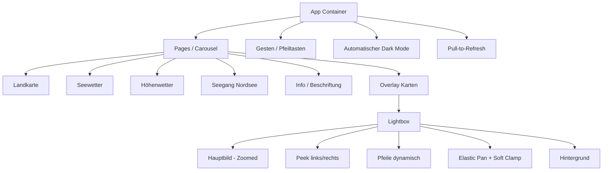

## UI-Struktur

> Release 1.0: Fokus auf ruhige, bildschirmfüllende Wetterkarte ohne Menü, mit natürlicher Navigation und automatischem Dark Mode.
> Update US-009: Lightbox zeigt subtile Peek-Nachbarn und nutzt zyklische, weiche Bildnavigation.
> Update US-010: Zoom-Pan verhält sich elastisch mit weichem Snap-Back beim Loslassen.
> Update US-011: Neue Carousel-Seite für Seegang Nordsee mit zweizeiligem Kartenlayout.

