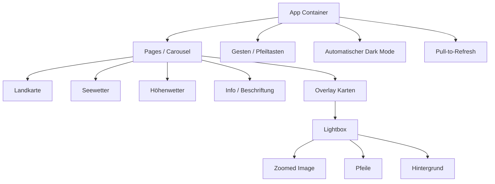

## UI-Struktur

> Release 1.0: Fokus auf ruhige, bildschirmfüllende Wetterkarte ohne Menü, mit natürlicher Navigation und automatischem Dark Mode.

```mermaid
flowchart TD
  App[App Container] --> Pages[Pages / Carousel]
  Pages --> Land[Landkarte]
  Pages --> See[Seewetter]
  Pages --> Hoehenwetter[Höhenwetter]
  Pages --> Texte[Info / Beschriftung]
  Pages --> Cards[Overlay Karten]
  Cards --> Lightbox[Lightbox]
  Lightbox --> Image[Zoomed Image]
  Lightbox --> Arrows[Pfeile]
  Lightbox --> Overlay[Hintergrund]
  App --> Gestures[Gesten / Pfeiltasten]
  App --> Theme[Automatischer Dark Mode]
  App --> Refresh[Pull-to-Refresh]
```
