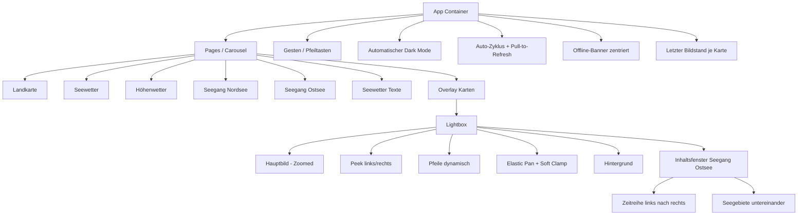

## UI-Struktur

> Teststatus (2026-06-20): Erfolgreich abgeschlossen (US-015/US-016, End-to-End geprueft).

> Release 1.0: Fokus auf ruhige, bildschirmfüllende Wetterkarte ohne Menü, mit natürlicher Navigation und automatischem Dark Mode.
> Update US-009: Lightbox zeigt subtile Peek-Nachbarn und nutzt zyklische, weiche Bildnavigation.
> Update US-010: Zoom-Pan verhält sich elastisch mit weichem Snap-Back beim Loslassen.
> Update US-011: Neue Carousel-Seite für Seegang Nordsee mit zweizeiligem Kartenlayout.
> Update US-012: Zusätzliche Carousel-Seite für Seegang Ostsee im gleichen Interaktions- und Layoutprinzip.
> Update US-013: Einheitlicher Seegang-Datenzyklus für alle WX_SEE-Seiten (~07/~19 UTC).
> Update US-014: Offline-Zugriff mit stabiler Wiederverwendung des letzten Bildstands je Karte, auch nach Resize/Orientation-Change.
> Update US-021: In der gezoomten Lightbox-Ansicht der Seite Seegang Ostsee wird pro aktuell geöffneter Karte ein kompaktes, optisch abgesetztes Inhaltsfenster eingeblendet; es enthält die kompakte Ostsee-Zeitreihen-Ansicht und lässt sich bei Bedarf zusammenklappen.
> Update US-020: Das Ostsee-Inhaltsfenster zeigt eine Zeitreihen-/Meteogramm-Tabelle (Wind, Boeen, Welle, Wetter) auf Basis der DWD-Seewettervorhersage Ostsee.
> Update US-020b: Das Ostsee-Zeitreihenfenster startet unterhalb der oberen Titelzeile und ist auf maximal ein Drittel der Fensterhoehe begrenzt.
> Update US-020c: Wind und Boeen werden nach Starkwind-/Sturmregeln eingefaerbt, Richtungsbereiche zeigen kombinierte Pfeile (z. B. W-NW), der Zeitslot-Header bleibt sticky und die Fensterbreite wurde erweitert.
> Update US-020d: Boeen werden als B-Praefix direkt am Wert dargestellt (gleiche Farbe), Rotfaerbung fuer Boeen erst ab >=8 Bft; vertikale Fensterhoehe wurde reduziert und horizontales Scrollen bleibt nur fuer sehr schmale Displays verfuegbar.
> Update US-020e: Wetterwerte mit FOG/MIST/BR werden als Warnbadge dargestellt; FOG zeigt drei, MIST/BR zwei horizontale CSS-Striche – kein Emoji, browseruebergreifend zuverlaessig.
> Update US-022: Für die Seite Seegang Nordsee wird eine analoge, kompakte Zeitreihen-Ansicht in der Lightbox ergänzt, basierend auf der DWD-Nordsee-Vorhersage.

